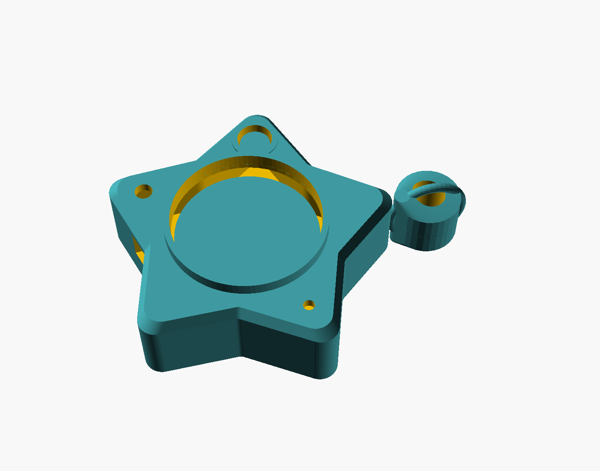
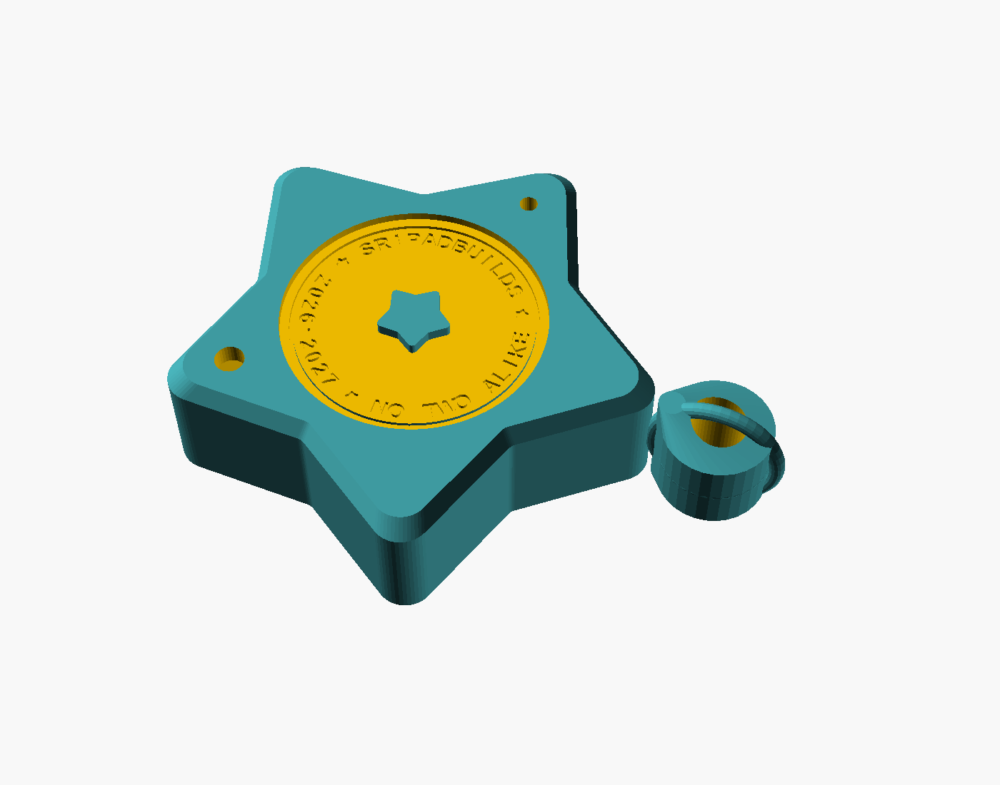
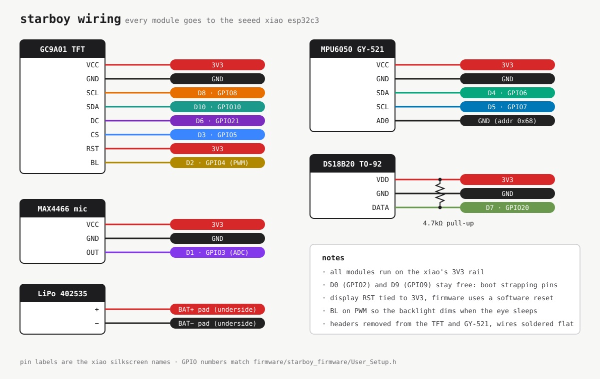

# starboy diy

a chrome star keychain with a little animated eye in the middle. shake it and the eye gets dizzy, take it somewhere cold and it starts shivering, yell near it and it gets nervous. leave it alone long enough and it falls asleep.

it's my handbuilt take on the [creature starboy](https://lilguy.net). i wanted one, and more than that i wanted to know how one works inside, so i designed the shell from scratch in openscad, picked the smallest parts i could find that would fit, and wrote the eye animations myself.

  
  

---

## how it works

the brain is a seeed xiao esp32c3, a board about the size of a thumbnail with a battery charger built in. it drives a 1.28" round screen that acts as the eye, and it listens to three sensors:

- an **mpu6050** that feels shaking and tilting
- a **ds18b20** that pokes out of a tiny vent to read the air temperature
- a **max4466** mic that hears loud sounds

a small lipo sits at the back, and it charges through the xiao's usb-c port, which lines up with a cutout in the shell. the whole thing is 20.5mm thick and clips onto your pants.

---

## what the eye does

| if you... | the eye... |
|-----------|-----------|
| shake it hard for a second | gets dizzy, then angry, then calms down |
| take it below 10°c | gets chilly, shivers, then freezes with a blue tint |
| make a loud noise | jumps, then darts around nervously |
| tilt it | looks toward the ground |
| ignore it for 25s | starts dozing and the screen dims |
| ignore it for 75s | falls asleep and breathes slowly |
| shake it or make noise while it sleeps | wakes up |
| just let it sit | cycles through 50 little expressions |
| wait around | every so often plays one of 20 rare effects like rainbow eyes, hearts, glitches, matrix rain or a galaxy swirl |

the first time a star turns on, it rolls its own eye color, pupil color and highlight style and keeps them forever. so no two stars look the same.

---

## what's in here

- [`cad/starboy_assembly.step`](CAD/starboy_assembly.step): the full 3d assembly (front, back and bezel)
- [`cad/starboy_star.scad`](CAD/starboy_star.scad): the parametric openscad file everything comes from
- [`stl/`](stl/): print-ready front, back and bezel
- [`firmware/`](firmware/starboy_firmware/): the arduino code, the screen config and the pin-by-pin wiring
- [`bom.csv`](BOM.csv): parts, prices and buy links
- [`bom.md`](BOM.md): the same list in plain words, plus what a second star costs
- [`build.md`](BUILD.md): printing, painting and putting it together

there's no custom pcb. everything is hand-wired to the xiao with thin 30awg wire, because that's the only way it all fits in the shell.

---

## what it costs

one star is **$96.86**, all from amazon, so it shows up in a few days instead of a month. the full list is in [bom.csv](BOM.csv).

most of the parts come in multi-packs, so a second star only needs another xiao, another battery and filament. that comes to **$53.62**, and the list is in [bom.md](BOM.md#build-2).

---

## wiring

every module runs off the xiao's 3.3v pin. if you want every single connection spelled out, it's in [wiring.md](firmware/starboy_firmware/WIRING.md).

---

## printing and finishing

print the three files in [`stl/`](stl/) in petg, with white for the shell and black for the bezel ring. petg holds up way better than pla when it's hanging off a belt loop every day or sitting in a hot car. orientation and supports are in [build.md](BUILD.md).

for the chrome look, sand it smooth (400, then 800, then 1500), hit it with plastic primer, spray the chrome, and buff it lightly with 0000 steel wool once it's dry.

---

## flashing the firmware

open `firmware/starboy_firmware/starboy_firmware.ino` in the arduino ide, pick **xiao_esp32c3** as the board, and turn on **usb cdc on boot**.

install these from the library manager:

- tft_espi by bodmer
- adafruit mpu6050
- adafruit unified sensor
- dallastemperature
- onewire

one extra step for tft_espi: copy [`user_setup.h`](firmware/starboy_firmware/User_Setup.h) into its library folder so it knows about the round screen and which pins it's on.

---

## about the battery

the xiao doesn't have a battery plug, just two little pads on the bottom marked bat+ and bat−. so the plug gets cut off the battery and the wires get soldered straight onto those pads. check which wire is which with a multimeter before soldering, since cheap batteries don't always use red for positive.

a full charge lasts around 4 hours, and the screen dims itself whenever the eye gets sleepy to save power.

---

made by [@nadellasripad11](https://github.com/nadellasripad11) · sripadbuilds · inspired by [creature](https://lilguy.net) by daniel kuntz
