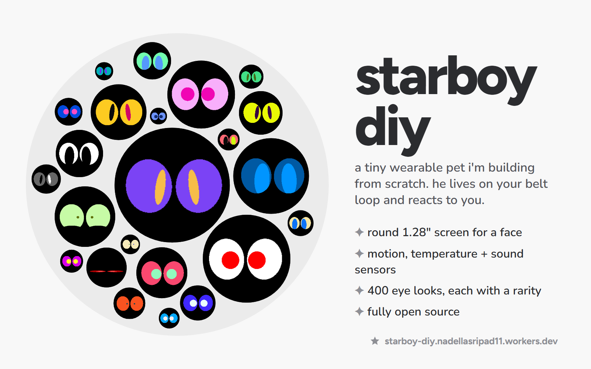
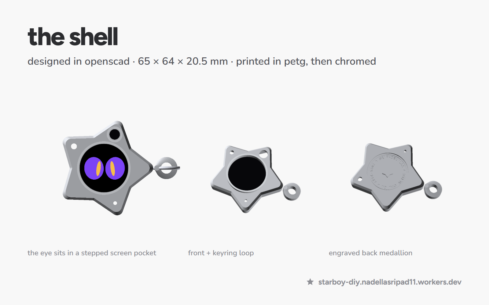
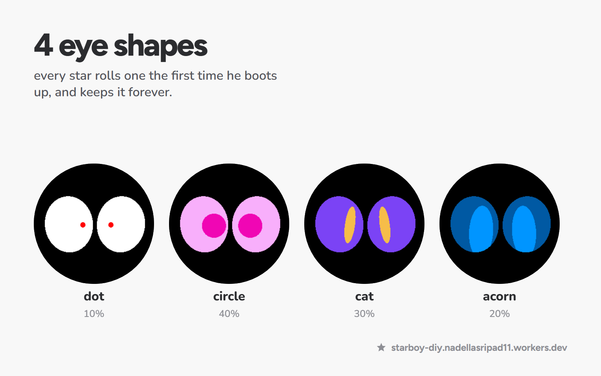
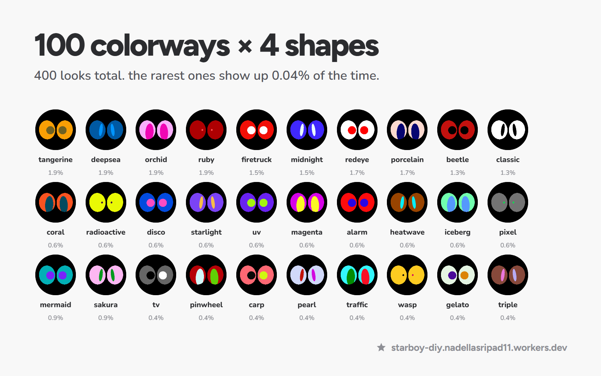
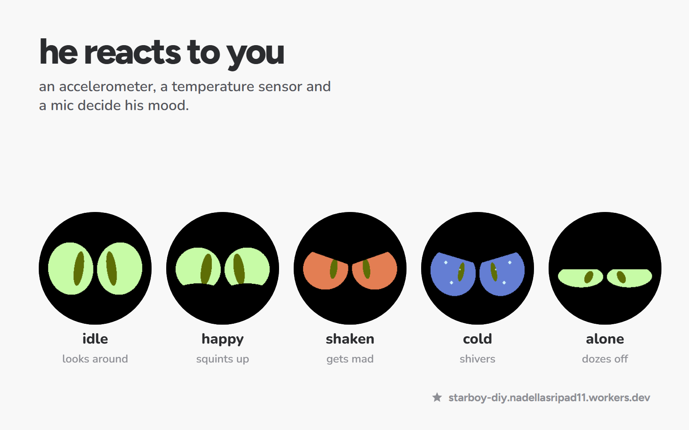
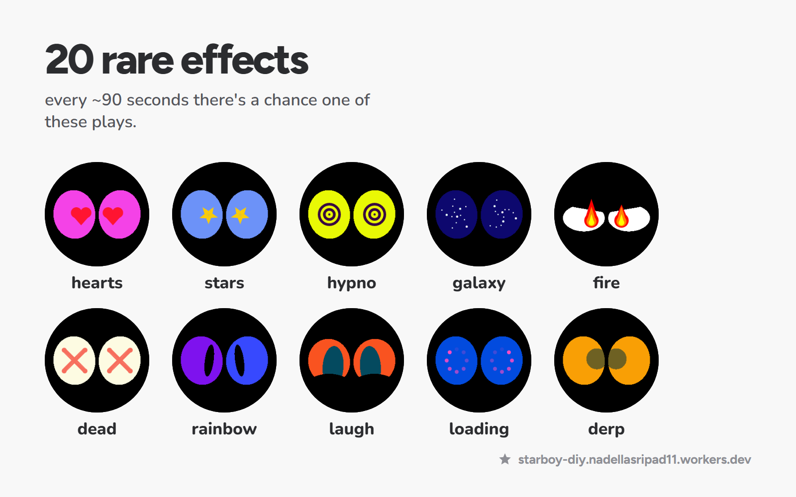
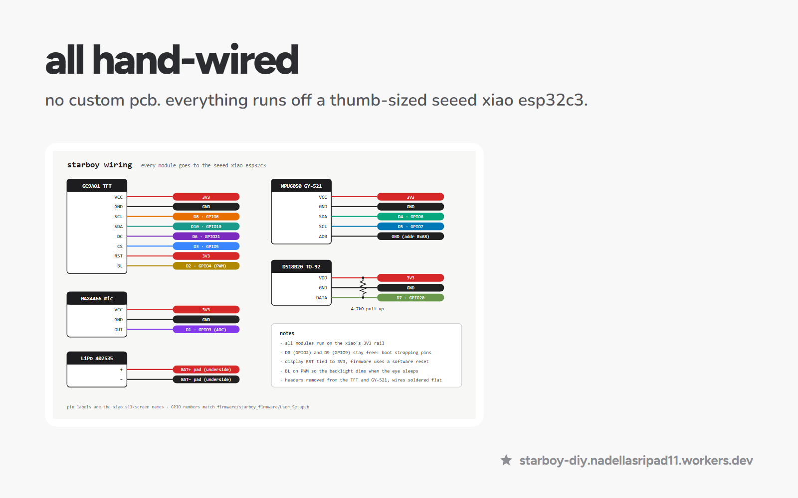

# devlog #1 · starboy diy

**tl;dr** i'm building a tiny wearable pet from scratch. he clips onto your belt loop, has a round screen for a face, and reacts to shaking, cold and loud noises. the shell, eyes and firmware are done, parts are next.

---

## what i'm making

a chrome star about the size of a keychain, with a 1.28" round screen in the middle that acts as his eye. inside is a thumb-sized esp32 board and three sensors: an accelerometer, a temperature sensor and a microphone. shake him and he gets dizzy then mad. take him somewhere cold and he shivers. yell near him and he gets nervous. ignore him and he falls asleep.

## designing the shell

i designed the whole shell in openscad. the hardest part was depth. the screen, board, motion sensor and battery all stack inside a body that's only **20.5mm** thick, which leaves **0.5mm** of slack. i put asserts in the cad file so if a dimension ever changes and something stops fitting, it refuses to build instead of letting me print a broken shell.

one thing that bit me: every listing says the round screen is 32.4mm, but that's just the glass. the actual circuit board is **37.5mm**. so the screen pocket is stepped: a narrow opening you see through, with a wider ledge behind it that holds the board.

the back has an engraved medallion, and there are through-holes for the temperature sensor and mic so they read the outside air instead of the heat from the board.

## the eyes

this is the part i'm proudest of. every star rolls his own eyes the first time he turns on and keeps them forever. there are **4 shapes** (dot, circle, cat and acorn) and **100 colorways**, so **400 looks**, each with its own rarity. the rarest ones only come up 0.04% of the time.

each eye is drawn row by row on a 240×240 screen: a tilted oval with a pupil clipped to its edge. blinks squash the eye instead of just covering it, and happy moods push the bottom lid up into a little arch.

## making him react

the firmware is a state machine. shake him for a second and he spins dizzy, then gets grumpy. below 10°c he turns icy blue and shivers. a loud sound makes him jump and dart his eyes around. after 25 seconds alone he dozes, after 75 he's fully asleep and dreaming, and the backlight dims so the battery lasts longer.

and every ~90 seconds there's a chance he plays one of 20 rare effects: heart eyes, spinning stars, hypno rings, a galaxy, fire, X eyes and more.

## wiring

there's no custom pcb. everything is hand-wired to a seeed xiao esp32c3 with thin 30awg silicone wire, because that's the only way it all folds into the shell. the xiao also has a battery charger built in, so he charges over usb-c through a cutout in the side.

## parts

i first planned to order everything from aliexpress, but shipping takes 15–40 days, so i moved every part to amazon instead. one star comes to about **$97** in parts, and most parts come in multi-packs, so i'm building two.

## a website you can play with

i built a site where the eyes follow your cursor and you can trigger every reaction and rare effect. it runs the same eye code as the real firmware:
**[starboy-diy.nadellasripad11.workers.dev](https://starboy-diy.nadellasripad11.workers.dev/)**

## what's next

- parts arrive, then i print the shell in petg and paint it chrome
- solder everything and flash the firmware onto the real screen for the first time
- tune the sensor thresholds so he reacts at the right moments
- post the first video of him actually alive 👀

follow along if you want to see him wake up for the first time. code, cad and parts list are all on [github](https://github.com/nadellasripad11/starboy-diy).
